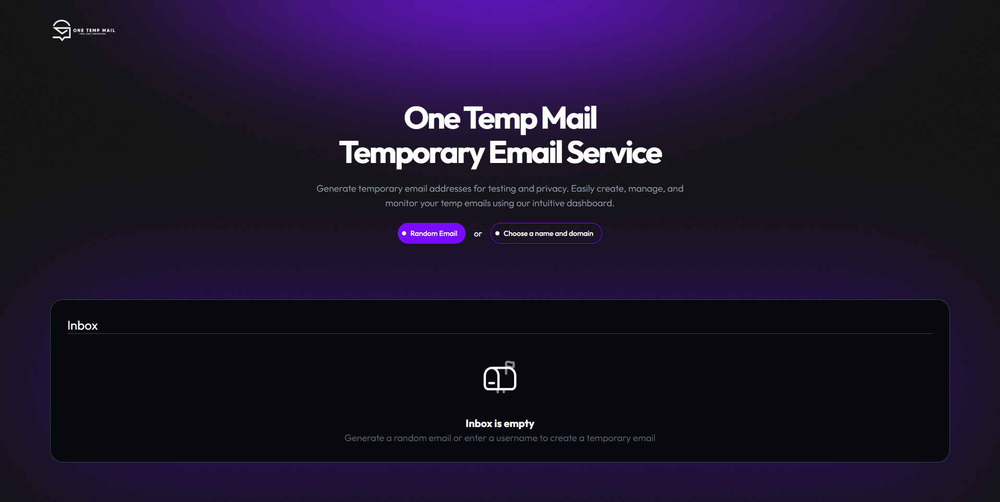

# One Temp Mail

[](https://mouadbt.github.io/one-temp-mail/ "Click to visit live demo")

A free, privacy-focused temporary email service built with React. Generate disposable emails, protect your inbox from spam, and enjoy a seamless user experience.

[](https://github.com/mouadbt/one-temp-mail/stargazers)
[](https://mouadbt.github.io/one-temp-mail/)

## Table of Contents
- [About](#about)
- [Features](#features)
- [Live Demo](#live-demo)
- [Technologies Used](#technologies-used)
- [Installation](#installation)
- [Usage](#usage)

## About
One Temp Mail is a free, open-source temporary email service built with React. It allows users to generate disposable email addresses (random or custom with hCaptcha verification), receive emails, and view contents in a user-friendly interface. Perfect for protecting your privacy and avoiding spam when signing up for online services.

## Features
- 📨 Generate random or custom temporary email addresses
- 🔒 hCaptcha verification for secure custom email creation
- 📥 Real-time email inbox with instant message updates
- 🎨 Responsive, user-friendly interface built with React and Tailwind CSS
- 🛡️ Protect your personal email from spam and privacy risks

## Live Demo
Try One Temp Mail in action: [One Temp Mail](https://mouadbt.github.io/one-temp-mail/)

*See it work: Generate a temporary email and receive messages in real-time!*

## Technologies Used
- **React**: For building the user interface
- **Tailwind CSS**: For responsive styling
- **shadcn/ui**: For modern UI components

## Installation
1. Clone the repository:
   ```bash
   git clone https://github.com/mouadbt/one-temp-mail.git
   ```
2. Install dependencies:
   ```bash
   npm install
   ```
3. Start the development server:
   ```bash
   npm run dev
   ```

## Usage
1. Open `http://localhost:5173/` in your browser.
2. Enter a username or random text to generate a temporary email.
3. Click "Generate Email" to create a disposable address.
4. Copy the email and use it for sign-ups or testing.
5. Monitor the inbox for incoming emails in real-time.
