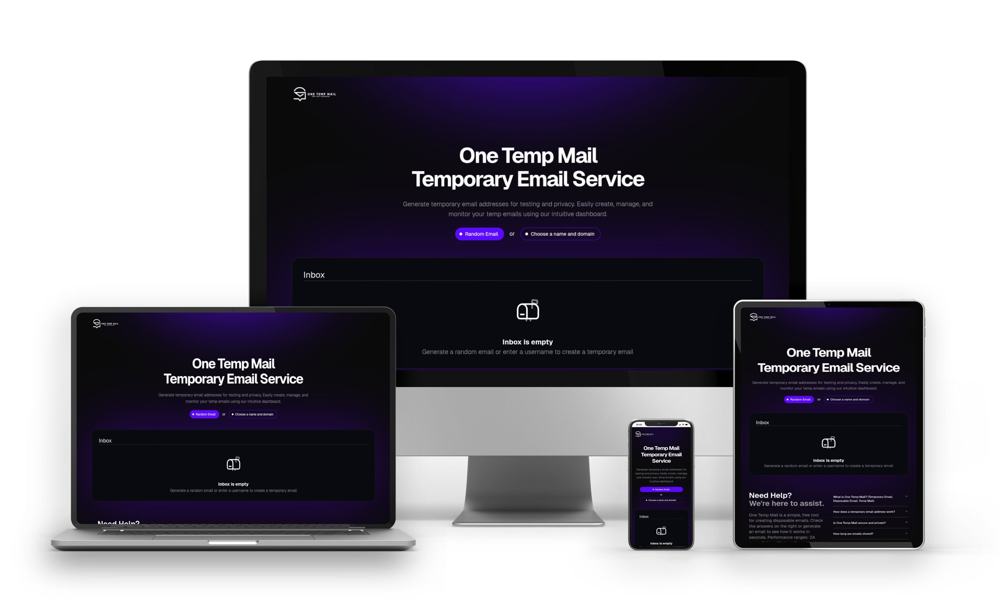
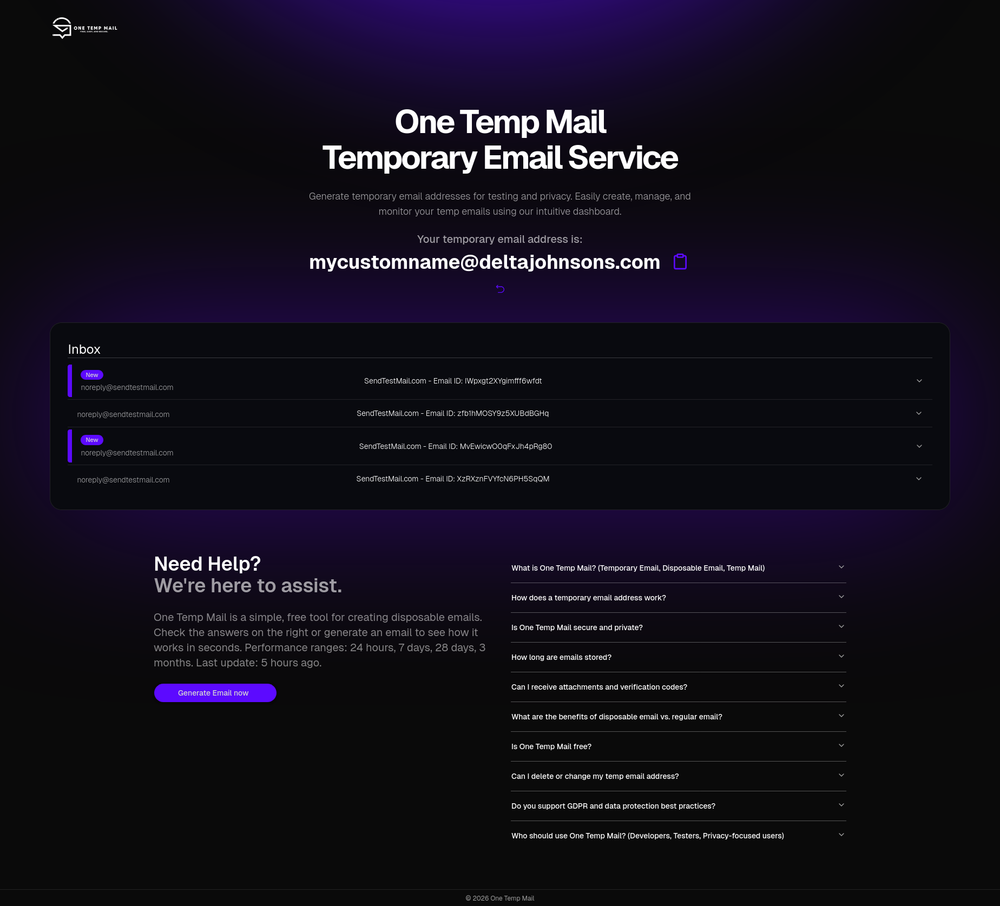
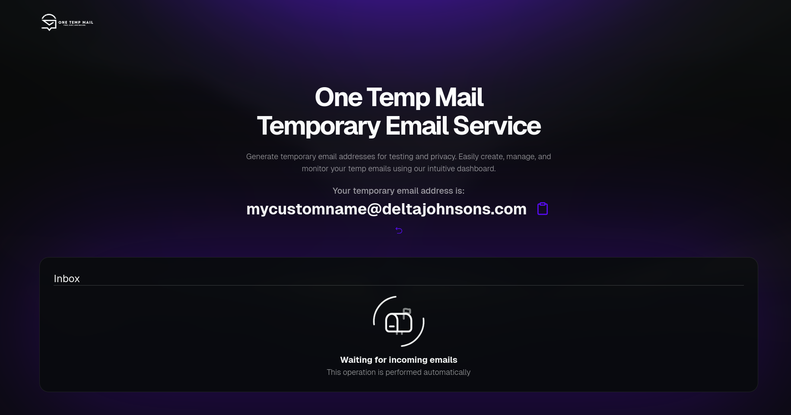
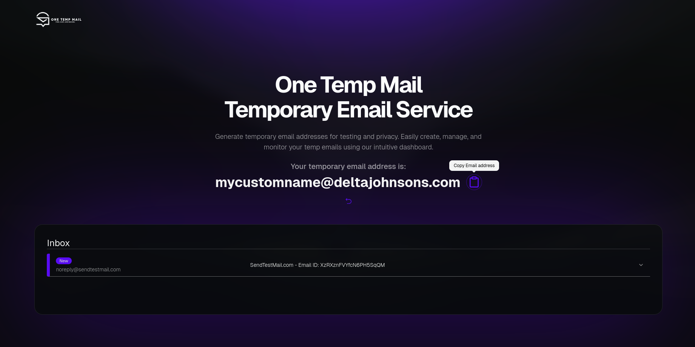
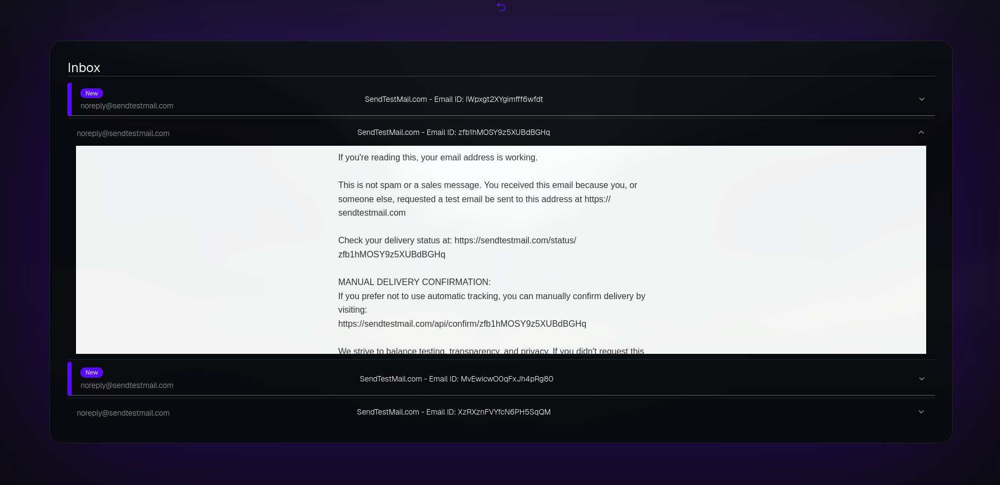
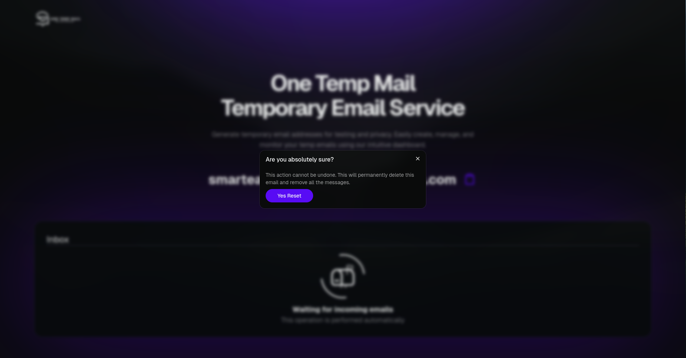

# One Temp Mail


A modern, privacy-focused web application for generating disposable temporary email addresses. Protect your real inbox from spam, advertising mailings, and hacking attempts by using a secure temporary email.



> [!IMPORTANT]
> **Privacy Note:** All generated emails are temporary. Once you reset or the session expires, the data is removed to ensure your privacy and security.

## Table of Contents
- [Screenshots](#screenshots)
- [Features](#features)
- [Tech Stack](#tech-stack)
- [Getting Started](#getting-started)
- [Available Scripts](#available-scripts)
- [License](#license)
- [Acknowledgments](#acknowledgments)

## Screenshots











## ✨ Features

- 📧 **Instant Generation**: Create random temporary email addresses with one click.
- ✏️ **Custom Addresses**: Choose your preferred username and domain for a personalized experience.
- 📥 **Real-time Inbox**: Receive emails instantly with automatic refreshing and desktop-like notifications.
- 🛡️ **Anti-Spam Protection**: Use hCaptcha to prevent bot abuse and ensure service stability.
- 🎨 **Premium UI/UX**: Clean, responsive interface built with Tailwind CSS 4 and shadcn/ui.
- ⚡ **High Performance**: Optimized with Vite for lightning-fast loading and smooth transitions.
- 📱 **Mobile Ready**: Fully responsive design that works perfectly on any device.

## 🛠️ Tech Stack

- **React 19** - UI framework
- **Vite** - Build tool and development server
- **Tailwind CSS 4** - Utility-first styling
- **shadcn/ui** - High-quality accessible components
- **TanStack Query (React Query)** - Powerful asynchronous state management
- **Framer Motion** - Fluid animations and transitions
- **Axios** - Promise-based HTTP client
- **Lucide Icons** - Beautifully simple icons

## 🚀 Getting Started

### Prerequisites

- Node.js (v18 or higher)
- npm or yarn

### Installation

1. Clone the repository:
   ```bash
   git clone https://github.com/mouadbt/one-temp-mail.git
   cd one-temp-mail
   ```

2. Install dependencies:
   ```bash
   npm install
   ```

3. Create a `.env` file and add your API base URL:
   ```env
   VITE_API_BASE_URL=https://api.mail.tm
   ```

4. Start the development server:
   ```bash
   npm run dev
   ```

5. Open your browser and navigate to `http://localhost:5173`

## 📦 Available Scripts

- `npm run dev` - Start the development server
- `npm run build` - Build for production
- `npm run preview` - Preview the production build locally
- `npm run lint` - Run ESLint for code quality

## 📄 License

This project is open source and available under the [MIT License](LICENSE).

## 🙏 Acknowledgments

- [Mail.tm API](https://mail.tm/) - For providing the backend email infrastructure
- [React](https://react.dev/)
- [Vite](https://vitejs.dev/)
- [Tailwind CSS](https://tailwindcss.com/)
- [shadcn/ui](https://ui.shadcn.com/)
- [TanStack Query](https://tanstack.com/query/latest)
